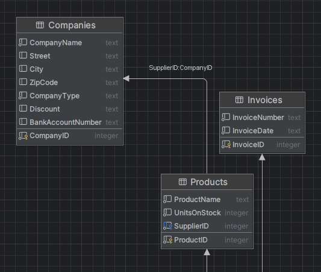
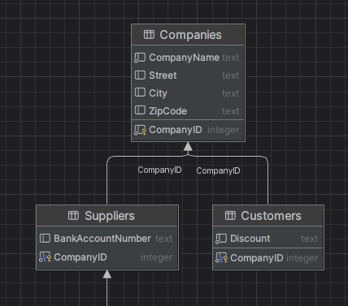

# Bazy Danych
## Entity Framework
#### Autorzy

**`Grupa 8 - [Śr 12:15 , A]`**

- Bartosz Ludwin
- Mateusz Pawliczek
- Filip Malejki

Na zajęciach udało się zrealizować `Część I` oraz podpunkty `a` i `b` z `Części II`. Reszta zadań została zrealizowana po zajęciach.

## Część I:

___
## Część II:

## A) Tworzenie tabel

Dodanie relacji:

Diagram bazy (wygenerowany w DataGrip):

Dodanie nowego suppliera (podpunkt i)

Dodanie stworzonego dostawcy do wcześniejszego produktu (podpunkt ii)

Wynik przed:

Wynik po:

___

## B) Zmieniamy relację

Dodajemy kilka produktów do nowego dostawcy

Wynik przed:

Wynik po:

___

# C) Modyfikacja relacji

Dodajemy kilka produktów do nowego dostawcy

Wynik po:

___

# D) Stworzenie nowych tabel
### (dodajemy również pośrednią encję InvoiceProduct, ponieważ inaczej nie moglibyśmy dodać wartości "Quantity")

Dodanie relacji:

Schemat graficzny:

Dodanie kilku produktów i sprzedanie ich w ramach faktur:

Kod wyświetlający produkty sprzedane w ramach wybranej faktury/transakcji:

Kod wyświetlający faktury, w ramach których sprzedany został wybrany produkt:

Wynik:

___

# E) Dodanie nowych tabel:

Dodanie relacji między nimi

Schemat:

Kod dodający klienów:

Kod wyświetlających klientów:

Wynik:

___

# F) Strategia `Table-Per-Type`
Użyte tabele (bez zmian)

Nowa modyfikacja relacji:

Schemat:

Kod dodający klienów:

Kod wyświetlających klientów:

Wynik:

# G) Porównanie obu strategii
Strategie **TPH** `(Table-per-Hierarchy)` i **TPT** `(Table-per-Type)` różnią się sposobem odwzorowania dziedziczenia w relacyjnej bazie danych, a co za tym idzie: wydajnością, przejrzystością danych i ich spójnością.

**TPH** umieszcza całą hierarchię dziedziczenia w jednej tabeli. Skutkuje to tym, że wszystkie właściwości z klas bazowych i pochodnych znajdują się w jednej strukturze danych, a nieużywane kolumny dla danego rekordu pozostają puste. TPH upraszcza model bazy, jest bardziej wydajna przy odczytach, ponieważ eliminuje konieczność używania złożonych zapytań z JOINami. Jednak ta prostota i wydajność okupiona jest mniejszą przejrzystością danych, trudnością w zapewnieniu spójności oraz obecnością wielu NULL-i w kolumnach nieistotnych dla konkretnego typu.

Z kolei **TPT** rozdziela strukturę danych między osobne tabele – każda klasa dziedzicząca ma własną tabelę zawierającą wyłącznie swoje właściwości, a dane wspólne są przechowywane w tabeli bazowej. Zapytania do takich danych wymagają dołączeń między tabelami, co znacząco wpływa na wydajność przy dużych zbiorach danych lub częstym odczycie. TPT zapewnia jednak większą przejrzystość modelu i pozwala zachować ścisłą spójność danych (np. pola typowe tylko dla PublicCompany nie mogą pojawić się przypadkowo w rekordzie PrivateCompany). Struktura jest bliższa obiektowemu dziedziczeniu i czytelniejsza, szczególnie przy bardziej rozbudowanych hierarchiach klas.

